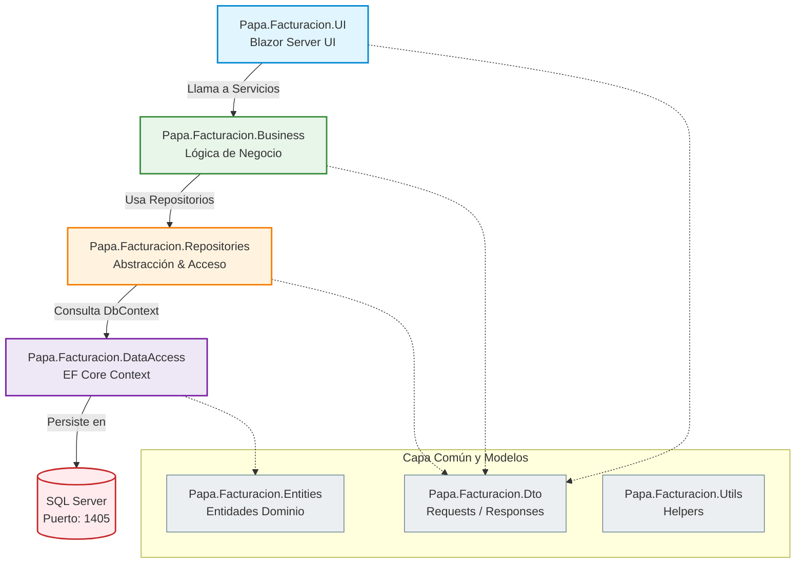

# Sistema de Facturación

Proyecto de facturación construido con **.NET 10** y **Blazor Server** (Interactive Server render mode).
Reúne la UI en Blazor, la capa de negocio, acceso a datos con Entity Framework Core y repositorios organizados por proyectos dedicados.

## Diagrama de Arquitectura

A continuación se muestra el diagrama que representa el flujo y la relación de dependencia entre las distintas capas del sistema:



## Patrones de Diseño y Arquitectura Utilizados

El sistema se diseñó siguiendo buenas prácticas de desarrollo de software para plataformas empresariales, implementando los siguientes patrones:

1. **Arquitectura Multicapa (Layered Architecture):**
   * Separación física y lógica de responsabilidades. Cada capa tiene un propósito único y se comunica de manera descendente.
2. **Patrón Repositorio (Repository Pattern):**
   * Centraliza la lógica de acceso a datos utilizando una interfaz genérica `IBaseRepository<TEntity>` e implementaciones específicas, evitando duplicar código SQL/LINQ y facilitando la mantenibilidad y pruebas unitarias.
3. **Inyección de Dependencias (Dependency Injection) por Convención:**
   * Utiliza la librería **Scrutor** para escanear y registrar automáticamente en el contenedor de servicios de .NET todas las implementaciones de interfaces bajo un esquema de ciclo de vida Scoped, evitando el registro manual individual en el `Program.cs`.
4. **Patrón DTO (Data Transfer Objects) y Mapeo:**
   * Desacopla la lógica de almacenamiento/base de datos de la lógica de presentación. Los datos viajan a través de DTOs mapeados transparentemente hacia y desde las entidades del dominio con **Mapster**.
5. **Code-Behind en Componentes UI:**
   * Las vistas Razor de Blazor (ej. `CreateInvoices.razor`) se mantienen enfocadas en el marcado HTML/Bootstrap y se vinculan a clases parciales de C# (ej. `CreateInvoices.razor.cs`) donde reside la lógica de comportamiento del componente.


## Resumen de la arquitectura
- UI (Blazor Server)
  - `Papa.Facturacion.UI` — Aplicación de interfaz usando Blazor Server.
- Lógica de negocio
  - `Papa.Facturacion.Business` — Servicios e implementaciones de la lógica de negocio.
- Acceso a datos
  - `Papa.Facturacion.DataAccess` — `DbContext` y entidades generadas; configuración de EF Core.
- Repositorios
  - `Papa.Facturacion.Repositories` — Implementaciones de acceso a datos (repositorios).
- DTOs
  - `Papa.Facturacion.Dto` — Objetos de transferencia entre capas.

Flujo general: UI -> Servicios (Business) -> Repositorios -> DbContext (SQL Server).

## Tecnologías clave
- Plataforma: .NET 10 (TargetFramework: `net10.0`)
- Interfaz: Blazor (Razor Components, Interactive Server render mode)
- ORM: Entity Framework Core (SQL Server)
- Paquetes destacados:
  - `Blazor.Bootstrap` — componentes Bootstrap para Blazor
  - `CurrieTechnologies.Razor.SweetAlert2` — diálogos SweetAlert2
  - `Mapster` — mapeo DTO <-> entidad
  - `Scrutor` — escaneo / registro de dependencias
- Base de datos: SQL Server (cadena de conexión usada: `cnFacturacion`)

## Requisitos
- .NET SDK 10 instalado
- SQL Server (o instancia compatible)
- Visual Studio 2022/2026 o VS Code

## Configuración rápida (desarrollo)

1. Clonar el repositorio
   - git clone https://github.com/FredyPapa/PapaFacturacion
2. Establecer la cadena de conexión
   - La aplicación espera una connection string llamada `cnFacturacion`.
   - Opciones:
     - Editar `appsettings.Development.json` / `appsettings.json` del proyecto `Papa.Facturacion.UI` y agregar:
       ```json
       {
         "ConnectionStrings": {
           "cnFacturacion": "Server=TU_SERVIDOR;Database=TU_BD;User Id=USUARIO;Password=CONTRASEÑA;TrustServerCertificate=True;"
         }
       }
       ```
     - O usar `dotnet user-secrets` en entorno local:
       - `dotnet user-secrets set "ConnectionStrings:cnFacturacion" "Server=...;Database=...;User Id=...;Password=...;"`
3. Restaurar paquetes y compilar
   - Desde la raíz o dentro de la carpeta `Papa.Facturacion.UI`:
     - `dotnet restore`
     - `dotnet build`
4. Crear / actualizar la base de datos
   - Si usas migraciones EF:
     - Instalar herramientas: `dotnet tool install --global dotnet-ef` (si no instalado)
     - Ejecutar (ejemplo):
       - `dotnet ef database update --project Papa.Facturacion.DataAccess --startup-project Papa.Facturacion.UI`
     - Si no hay migraciones, asegúrate de tener el esquema en la BD o ejecutar el script de creación correspondiente.
5. Ejecutar la aplicación
   - Desde Visual Studio: abrir la solución, establecer `Papa.Facturacion.UI` como proyecto de inicio y ejecutar.
   - Desde línea de comandos:
     - `cd Papa.Facturacion.UI`
     - `dotnet run`

La app usa en Program.cs:
- `builder.Services.AddRazorComponents().AddInteractiveServerComponents()` y
- `app.MapRazorComponents<App>().AddInteractiveServerRenderMode()` — indica que funciona como Blazor "Interactive Server".

## Notas para desarrolladores
- El nombre de la connection string debe coincidir con `cnFacturacion` (visto en `Program.cs`).
- El `DbContext` es `PapaFacturacionContext` (ver `Papa.Facturacion.DataAccess`).
- Scrutor se usa para el registro automático de dependencias (busca clases e interfaces en los ensamblados de negocio/repositorios).
- Para añadir nuevas dependencias registradas por convención, colocarlas en los ensamblados referenciados por el escaneo de Scrutor.
- Revisar `_Imports.razor` para `using` globales (componente `EditForm`, validadores, etc.).

## Comandos útiles
- Restaurar y ejecutar:
  - `dotnet restore`
  - `dotnet build`
  - `dotnet run --project Papa.Facturacion.UI`
- EF Core (migraciones):
  - `dotnet ef migrations add NombreMigracion --project Papa.Facturacion.DataAccess --startup-project Papa.Facturacion.UI`
  - `dotnet ef database update --project Papa.Facturacion.DataAccess --startup-project Papa.Facturacion.UI`

## Estructura de carpetas (resumen)
- /Papa.Facturacion.UI
- /Papa.Facturacion.Business
- /Papa.Facturacion.DataAccess
- /Papa.Facturacion.Repositories
- /Papa.Facturacion.Dto

## Contribución y contacto
- Desarrollador: Fredy Luis Papa Mata
- Branch principal: `main`
- Pull requests: abrir PRs desde ramas temáticas.
- Remote origin: https://github.com/FredyPapa/PapaFacturacion

